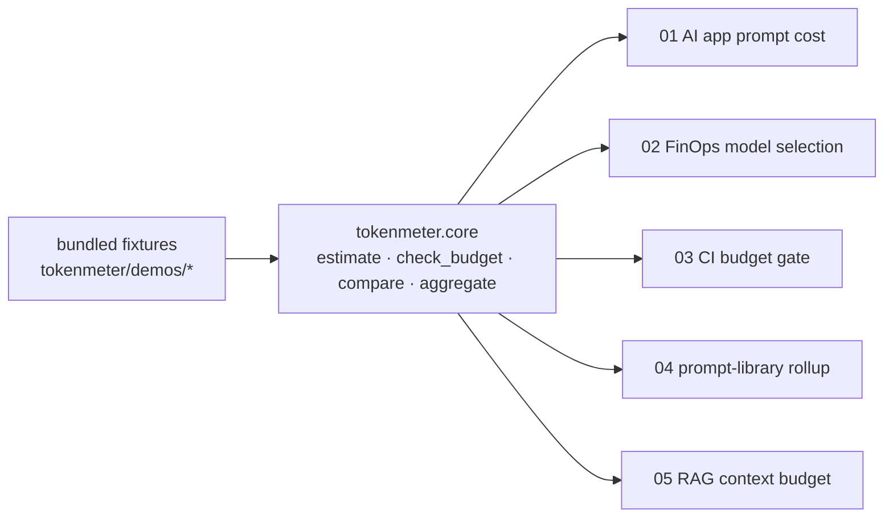
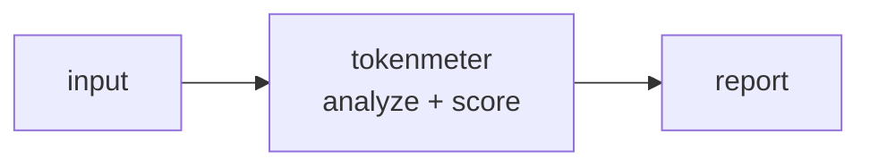

<a name="top"></a>
<div align="center">


# TOKENMETER

### Token and cost counter / budgeter for LLM apps, CI-ready


[](https://pypi.org/project/cognis-tokenmeter/) [](https://github.com/cognis-digital/tokenmeter/actions) [](LICENSE) [](https://github.com/cognis-digital)

*Developer Tools — fast, single-purpose, CI- and agent-friendly.*

</div>

```bash
pip install cognis-tokenmeter
tokenmeter count -f prompt.txt -m claude-sonnet -o 500   # tokens + cost in ms
```


<!-- cognis:example:start -->
## 🔎 Example output

Real, reproducible output from the tool — runs offline:

```console
$ tokenmeter-emit --version
tokenmeter 0.1.0
```

```console
$ tokenmeter-emit --help
usage: tokenmeter [-h] [--version] [--format {table,json,csv}]
                  {count,budget,models,batch,compare} ...

Token and cost counter / budgeter for LLM apps (CI-ready).

positional arguments:
  {count,budget,models,batch,compare}
    count               count tokens and estimate cost
    budget              fail (exit 1) if over a cost/token budget
    models              list known models and pricing
    batch               estimate many files and roll up
    compare             estimate one workload across all models, cheapest
                        first

options:
  -h, --help            show this help message and exit
  --version             show program's version number and exit
  --format {table,json,csv}
                        output format (default: table)
```

> Blocks above are real `tokenmeter` output — reproduce them from a clone.

**Sample result format** _(illustrative values — run on your own data for real findings):_

```
{
"findings": [
    {
        "id": "1234567890",
        "title": "Suspicious Network Traffic",
        "description": "Potential malicious activity detected on network interface 192.168.1.100",
        "created_by": "John Doe",
        "created_at": "2023-02-15T14:30:00Z"
    },
    {
        "id": "2345678901",
        "title": "Unusual File Access",
        "description": "File access pattern detected on file /path/to/suspicious/file.txt",
        "created_by": "Jane Smith",
        "created_at": "2023-02-16T10:15:00Z"
    }
]
}
```

<!-- cognis:example:end -->

## Usage — step by step

1. **Install** (Python 3.9+):

   ```bash
   pip install tokenmeter
   ```

2. **Count tokens and estimate cost** for some text or a file, against a pricing model:

   ```bash
   tokenmeter count -f prompt.txt -m claude-sonnet --output-tokens 500
   tokenmeter count -t "hello world" -m claude-sonnet
   ```

3. **List known models** and their pricing:

   ```bash
   tokenmeter models --format json | jq .
   ```

4. **Batch-estimate** many files and roll them up:

   ```bash
   tokenmeter batch prompts/*.txt -m claude-sonnet
   ```

5. **Gate a budget in CI.** `budget` exits `1` when the cost/token cap is exceeded:

   ```bash
   tokenmeter budget -f prompt.txt -m claude-sonnet --max-cost 0.05 || echo "Over budget"
   ```

6. **Compare every model for one workload**, cheapest first, and export it:

   ```bash
   tokenmeter compare -f prompt.txt -o 500                 # ranked table
   tokenmeter compare -f prompt.txt -o 500 --format csv    # for a spreadsheet
   tokenmeter models  --format csv                         # the whole price book
   ```

   `count`, `models`, `batch`, and `compare` all support `--format csv` for
   FinOps spreadsheets and dashboards, alongside `table` and `json`.

## Demos

Five runnable scenarios in [`demos/`](demos/) drive the **real** `tokenmeter`
API against bundled, offline fixtures — no network, no API keys, no heavy deps.
Each is narrated, audience-specific, and exits 0, so they double as smoke tests.
Full write-up: [`docs/DEMOS.md`](docs/DEMOS.md).

```bash
python demos/run_all.py                  # all five, end to end (exit 0)
python demos/03_ci_budget_gate.py        # or just one
```



| Demo | Audience | Scenario |
|---|---|---|
| [`01_ai_app_prompt_cost`](demos/01_ai_app_prompt_cost.py) | AI app devs | What one call costs across models, projected to daily volume |
| [`02_finops_model_selection`](demos/02_finops_model_selection.py) | FinOps / platform | Rank one workload cheapest-first; forecast the day-rate |
| [`03_ci_budget_gate`](demos/03_ci_budget_gate.py) | CI / release eng | Cost + context-window gates that fail the build like a linter |
| [`04_eng_manager_prompt_library`](demos/04_eng_manager_prompt_library.py) | Eng managers | Roll up a whole prompt library into one number |
| [`05_rag_context_budget`](demos/05_rag_context_budget.py) | RAG / context eng | Size the assembled RAG prompt; quantify the few-shot tax |

### Worked CLI demos

Each folder under [`tokenmeter/demos/`](tokenmeter/demos) is a real-use-case
scenario with an input file in the tool's real input format, a `SCENARIO.md`
explaining where the data came from and how to act, and exact CLI commands:

| Demo | Scenario |
|---|---|
| [`01-basic`](tokenmeter/demos/01-basic) | Budget an LLM system prompt in CI |
| [`02-rag-context`](tokenmeter/demos/02-rag-context) | Size an assembled RAG prompt before sending |
| [`03-model-selection`](tokenmeter/demos/03-model-selection) | Pick the cheapest model with `compare` |
| [`04-batch-prompt-library`](tokenmeter/demos/04-batch-prompt-library) | Roll up a whole prompt library with `batch` |
| [`05-chat-transcript`](tokenmeter/demos/05-chat-transcript) | Cost of continuing a multi-turn chat |
| [`06-context-window-guard`](tokenmeter/demos/06-context-window-guard) | Catch a context-window overflow before the API does |
| [`07-fewshot-vs-zeroshot`](tokenmeter/demos/07-fewshot-vs-zeroshot) | Quantify the recurring cost of few-shot examples |
| [`08-csv-finops`](tokenmeter/demos/08-csv-finops) | Export per-step agent cost as CSV for finance |
| [`09-stdin-pipeline`](tokenmeter/demos/09-stdin-pipeline) | Measure anything piped on stdin (e.g. a `git diff`) |


## Contents

- [Why tokenmeter?](#why) · [Features](#features) · [Quick start](#quick-start) · [Example](#example) · [Architecture](#architecture) · [AI stack](#ai-stack) · [How it compares](#how-it-compares) · [Integrations](#integrations) · [Install anywhere](#install-anywhere) · [Related](#related) · [Contributing](#contributing)

<a name="why"></a>
## Why tokenmeter?

AI cost control

`tokenmeter` is single-purpose, scriptable, and self-hostable: point it at a target, get prioritized results in the format your workflow already speaks (table · JSON · SARIF), gate CI on it, and let agents drive it over MCP.

<div align="right"><a href="#top">↑ back to top</a></div>

<a name="features"></a>
## Features

- ✅ Add Model
- ✅ Get Pricing
- ✅ List Models
- ✅ Count Tokens
- ✅ Estimate
- ✅ Check Budget
- ✅ Aggregate
- ✅ Compare models (rank one workload by cost, cheapest first)
- ✅ Output as table · JSON · CSV (CSV for FinOps spreadsheets)
- ✅ Runs on Linux/macOS/Windows · Docker · devcontainer
- ✅ Ports in Python, JavaScript, Go, and Rust (`ports/`)

<div align="right"><a href="#top">↑ back to top</a></div>

<a name="quick-start"></a>
## Quick start

```bash
pip install cognis-tokenmeter
tokenmeter --version
tokenmeter count -t "hello world" -m claude-sonnet      # count + cost
tokenmeter count -f prompt.txt -m gpt-4o --format json  # machine-readable
tokenmeter budget -f prompt.txt -m claude-opus --max-cost 0.01   # CI gate (exit 1)
tokenmeter compare -f prompt.txt -o 500                 # rank models by cost
```

<div align="right"><a href="#top">↑ back to top</a></div>

<a name="example"></a>
## Example

```text
$ tokenmeter compare -f prompt.txt -o 500
model          in_tok  out_tok  total_cost_usd  ctx_used_%
gpt-4o-mini    476     500      0.000371        0.76
claude-haiku   476     500      0.002381        0.49
gpt-4o         476     500      0.006190        0.76
claude-sonnet  476     500      0.008928        0.49
claude-opus    476     500      0.044640        0.49
```

<div align="right"><a href="#top">↑ back to top</a></div>

<a name="architecture"></a>
## Architecture



<div align="right"><a href="#top">↑ back to top</a></div>

<a name="ai-stack"></a>
## Use it from any AI stack

`tokenmeter` is interoperable with every popular way of using AI:

- **MCP server** — `tokenmeter mcp` (Claude Desktop, Cursor, Cognis.Studio, [uncensored-fleet](https://github.com/cognis-digital/uncensored-fleet))
- **OpenAI-compatible / JSON** — pipe `tokenmeter scan . --format json` into any agent or LLM
- **LangChain · CrewAI · AutoGen · LlamaIndex** — wrap the CLI/JSON as a tool in one line
- **CI / scripts** — exit codes + SARIF for non-AI pipelines

<div align="right"><a href="#top">↑ back to top</a></div>

<a name="how-it-compares"></a>
## How it compares

| | **Cognis tokenmeter** | tiktoken |
|---|:---:|:---:|
| Self-hostable, no account | ✅ | varies |
| Single command, zero config | ✅ | ⚠️ |
| JSON + SARIF for CI | ✅ | varies |
| MCP-native (AI agents) | ✅ | ❌ |
| Polyglot ports (JS/Go/Rust) | ✅ | ❌ |
| Open license | ✅ COCL | varies |

*Built in the spirit of **tiktoken**, re-framed the Cognis way. Missing a credit? Open a PR.*

<div align="right"><a href="#top">↑ back to top</a></div>

<a name="integrations"></a>
## Integrations

Pipes into your stack: **SARIF** for code-scanning, **JSON** for anything, an **MCP server** (`tokenmeter mcp`) for AI agents, and a webhook forwarder for SIEM/Slack/Jira. See [`docs/INTEGRATIONS.md`](docs/INTEGRATIONS.md).

<div align="right"><a href="#top">↑ back to top</a></div>

<a name="install-anywhere"></a>
## Install — every way, every platform

```bash
pip install "git+https://github.com/cognis-digital/tokenmeter.git"    # pip (works today)
pipx install "git+https://github.com/cognis-digital/tokenmeter.git"   # isolated CLI
uv tool install "git+https://github.com/cognis-digital/tokenmeter.git" # uv
pip install cognis-tokenmeter                                          # PyPI (when published)
docker run --rm ghcr.io/cognis-digital/tokenmeter:latest --help        # Docker
brew install cognis-digital/tap/tokenmeter                             # Homebrew tap
curl -fsSL https://raw.githubusercontent.com/cognis-digital/tokenmeter/main/install.sh | sh
```

| Linux | macOS | Windows | Docker | Cloud |
|---|---|---|---|---|
| `scripts/setup-linux.sh` | `scripts/setup-macos.sh` | `scripts/setup-windows.ps1` | `docker run ghcr.io/cognis-digital/tokenmeter` | [DEPLOY.md](docs/DEPLOY.md) (AWS/Azure/GCP/k8s) |

<div align="right"><a href="#top">↑ back to top</a></div>

<a name="related"></a>
## Related Cognis tools

- [`mcpforge`](https://github.com/cognis-digital/mcpforge) — Scaffold, test, and publish MCP servers in minutes
- [`promptlint`](https://github.com/cognis-digital/promptlint) — Lint, version, and test prompts as code with a CI gate
- [`envdoctor`](https://github.com/cognis-digital/envdoctor) — .env validator, secret-presence and config-drift checker
- [`apidiff`](https://github.com/cognis-digital/apidiff) — Breaking-change detector for OpenAPI / GraphQL across commits
- [`codeglance`](https://github.com/cognis-digital/codeglance) — Repo onboarding map — architecture + hotspots for humans and agents
- [`flakefinder`](https://github.com/cognis-digital/flakefinder) — Flaky-test detector from CI history with quarantine suggestions

**Explore the suite →** [🗂️ all 170+ tools](https://github.com/cognis-digital/cognis-neural-suite) · [⭐ awesome-cognis](https://github.com/cognis-digital/awesome-cognis) · [🔗 cognis-sources](https://github.com/cognis-digital/cognis-sources) · [🤖 uncensored-fleet](https://github.com/cognis-digital/uncensored-fleet) · [🧠 engram](https://github.com/cognis-digital/engram)

<div align="right"><a href="#top">↑ back to top</a></div>

<a name="contributing"></a>
## Contributing

PRs, new rules, and demo scenarios are welcome under the collaboration-pull model — see [CONTRIBUTING.md](CONTRIBUTING.md) and [SECURITY.md](SECURITY.md).

> ### ⭐ If `tokenmeter` saved you time, **star it** — it genuinely helps others find it.

## Interoperability

`{}` composes with the 300+ tool Cognis suite — JSON in/out and a shared
OpenAI-compatible `/v1` backbone. See **[INTEROP.md](INTEROP.md)** for the
suite map, composition patterns, and reference stacks.

## License

Source-available under the **Cognis Open Collaboration License (COCL) v1.0** — free for personal, internal-evaluation, research, and educational use; **commercial / production use requires a license** (licensing@cognis.digital). See [LICENSE](LICENSE).

---

<div align="center"><sub><b><a href="https://cognis.digital">Cognis Digital</a></b> · one of 170+ tools in the <a href="https://github.com/cognis-digital/cognis-neural-suite">Cognis Neural Suite</a> · <i>Making Tomorrow Better Today</i></sub></div>
