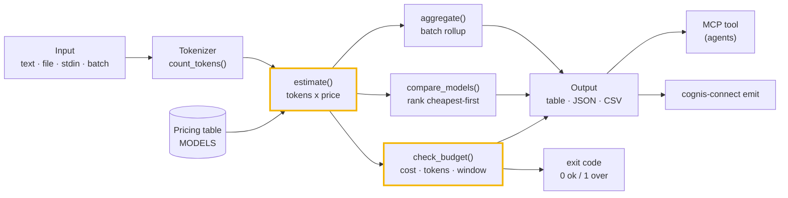
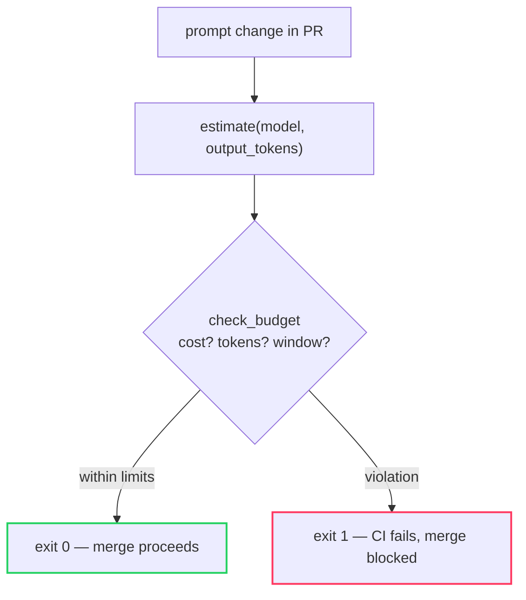

# Architecture

`tokenmeter` turns text (a prompt, a RAG context, a whole prompt library, or
anything on stdin) into a **token + cost estimate** and an optional **budget
verdict** you can gate CI on. It is a single, dependency-free Python package: no
network, no API keys, no vendor SDK. The pricing table is data, not logic, so it
is trivial to update or extend.

## The pipeline

## Components

### Tokenizer (`tokenmeter/core.py:count_tokens`)
A deterministic, dependency-free estimator. It splits text the way production
BPE tokenizers tend to: whitespace and punctuation are boundaries, long
alphanumeric runs break into ~4-character subword chunks, digit runs and symbols
each cost their own token, and blank lines carry tokens. It is an *estimator*
(not a byte-exact replay of any vendor's merge table), calibrated to land within
a few percent of real counts for typical prose and code — which is what
budgeting and CI gating need. No model download, no network call.

### Pricing table (`MODELS`)
A dictionary of `ModelPricing(name, input_per_1k, output_per_1k, context_window)`
covering representative public list prices (Claude Opus/Sonnet/Haiku, GPT-4o /
4o-mini / 4-turbo, and a `generic-1k`). It is intentionally **data**: update a
price in one place, or register a model at runtime with `add_model(...)`.

### Estimate (`estimate`)
The core call. Given text (or an explicit `input_tokens`) plus expected
`output_tokens` and a model, it returns an `Estimate`: input/output tokens,
per-side and total cost, the model's context window, and `context_used_pct`.
`to_dict()` is the stable JSON shape the CLI and MCP server emit.

### Budget check (`check_budget`)
Takes an `Estimate` and optional `max_cost_usd` / `max_tokens` ceilings and
returns a `BudgetResult` with an `ok` flag and human-readable `violations`. The
model's context window is **always** enforced: a prompt that cannot fit the
window is over budget even with no explicit ceiling. The CLI maps `ok` to the
process exit code, so `budget` behaves like a linter in CI.

### Compare & aggregate (`compare_models`, `aggregate`)
`compare_models` prices one workload across many models and sorts cheapest-first
for model-selection decisions. `aggregate` sums a batch of estimates (e.g. every
file in a prompt library) into one rollup. Both feed the same table/JSON/CSV
output path.

### CLI (`tokenmeter/cli.py`)
`count`, `budget`, `models`, `batch`, `compare` — each rendering `table`, `json`,
or `csv`. Input comes from `--text`, `--file`, stdin, or a file list (`batch`).
This is the surface the demos and CI examples drive.

### MCP server (`tokenmeter/mcp_server.py`) & emit (`tokenmeter/connect.py`)
The same estimates are served to agents as an MCP tool and can be forwarded as
canonical findings to STIX/MISP/Sigma/Splunk/Elastic/Slack via the optional
`cognis-connect` extra.

## How a budget gate flows

## Why these choices

- **No dependencies, no network.** The estimator is pure Python stdlib; nothing
  leaves your machine and there is nothing to download or authenticate.
- **Pricing is data.** Updating a vendor price or adding a model is a one-line
  change, not a code change — keep `models --format csv` under version control
  and diff it against invoices.
- **Exit codes by design.** `budget` is built to be a CI gate first: a violation
  is a non-zero exit, so it composes with every pipeline that already speaks
  exit codes.
